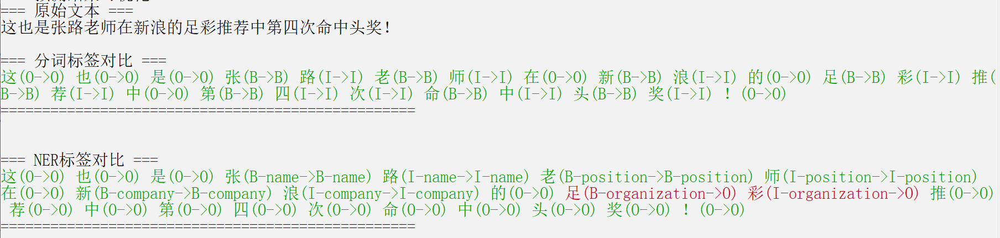
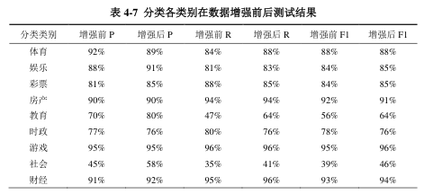

<!--
 * @Description:
 * @Author: shadow221213
 * @Date: 2023-10-06 17:14:05
 * @LastEditTime: 2025-07-24 23:14:47
-->
# <div align="center">A Multi-task model based on BERT for Chinese word</div>

<div align="center">
    <a href="https://github.com/shadow221213/A-Multi-task-model-based-on-BERT-for-Chinese-word/blob/master/README.md">
        English
    </a>
    |
    <a href="https://github.com/shadow221213/A-Multi-task-model-based-on-BERT-for-Chinese-word/blob/master/Chinese.md">
        简体中文
    </a>
</div>

**Continuously updated ----**

## Glossary

Chinese word Segmentation refers to dividing a sentence into individual words (similar to “punctuation”).

Text Classification refers to categorizing a passage into a specific type of information (e.g., sports, finance).

Named Entity Recognition (NER) refers to words with special meanings (e.g., proper nouns, place names).

A Multi-task system uses the same pre-trained model as a parameter-sharing layer for encoding, and employs different decoding layers for each task to produce the corresponding results.

## Project Introduction

This project is written in `python==3.9.21` and `torch==2.6.0`, for the specific environment.

If you need to install `torch`, please use this options to Download dependencies.

```
# ROCM 6.1 (Linux only)
pip install torch==2.6.0 torchvision==0.21.0 torchaudio==2.6.0 --index-url https://download.pytorch.org/whl/rocm6.1
# ROCM 6.2.4 (Linux only)
pip install torch==2.6.0 torchvision==0.21.0 torchaudio==2.6.0 --index-url https://download.pytorch.org/whl/rocm6.2.4
# CUDA 11.8
pip install torch==2.6.0 torchvision==0.21.0 torchaudio==2.6.0 --index-url https://download.pytorch.org/whl/cu118
# CUDA 12.4
pip install torch==2.6.0 torchvision==0.21.0 torchaudio==2.6.0 --index-url https://download.pytorch.org/whl/cu124
# CUDA 12.6
pip install torch==2.6.0 torchvision==0.21.0 torchaudio==2.6.0 --index-url https://download.pytorch.org/whl/cu126
# CPU only
pip install torch==2.6.0 torchvision==0.21.0 torchaudio==2.6.0 --index-url https://download.pytorch.org/whl/cpu
```

If you are using the GPU version, you can use `pip install -r requirements.txt` Download dependencies.

If you are using the CPU version, you can use `pip install -r requirements_cpu.txt` Download dependencies.

Please use `python main.py --mtl --augment --train --evaluate --freeze_cls` to train and evaluate the model using the augment data.
For more detailed commands, please use `python main.py --help` or `pyhton main.py -h` to view.

You can view performance graphs during training by running `tensorboard --logdir=./output/mtl_aug`.

Upon researching the literature, it was found that the three tasks of Chinese word Segmentation, Text Classification, and NER often appear together and are used in conjunction. This led to the idea of combining them into a single system, resulting in the Multi-task system proposed in this project.

For the Word Segmentation task, BiLSTM (bidirectional LSTM) is used to extract contextual information to facilitate word Segmentation (understanding ambiguous words).
For the Text Classification task, a linear model is used for categorization (since BERT already handles most of the information required for Classification).
For the NER task, the results from Word Segmentation are combined, and BiLSTM (bidirectional LSTM) is used to extract contextual information, which helps improve accuracy (since NER involves determining the meaning of words, and the boundaries of words are crucial).
For the specific program, please see [paper](./paper/A%20Multi-task%20model%20based%20on%20BERT%20for%20Chinese%20word.pdf).

## Experimental Results





|        Task Type         | Precision(P) | Recall(R) |   F1   |
| :----------------------: | :----------: | :-------: | :----: |
|   Chinese Segmentation   |    91.98%    |  91.43%   | 91.69% |
|   Text Classification    |    90.34%    |  78.61%   | 80.39% |
| Named Entity Recognition |    92.85%    |  76.39%   | 78.35% |

Ultimately, achieve synergistic improvement across multiple tasks, i.e., while achieving output across multiple tasks, the accuracy of each task is still improved.